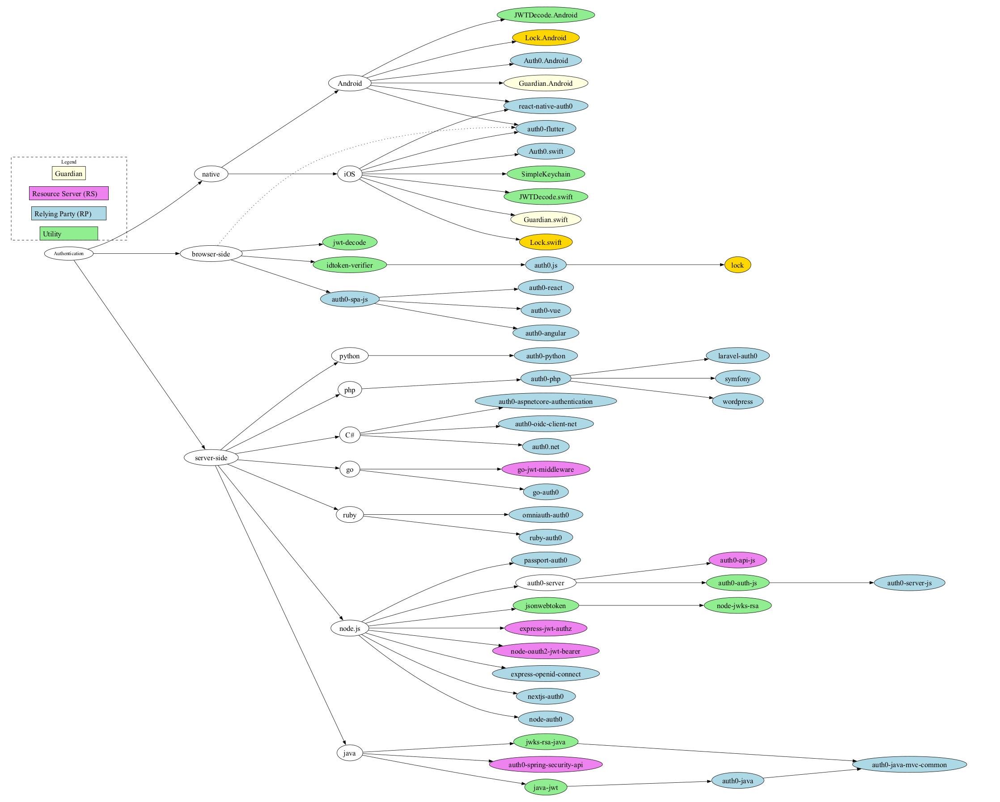

# Auth0 SDK Gallery with Terraform

Collection of sample codes using [Auth0 SDK libraries](https://auth0.com/docs/libraries)
and [Auth0 Terraform provider](https://registry.terraform.io/providers/auth0/auth0/latest/docs).

* [next.js](./next.js/readme.md)
* [java](./java/readme.md)

## Feature Matrix

### Server Side SDKs

#### Standard OAuth2 / OIDC Features

<table>
<thead>
    <tr>
        <th>
            SDK
        </th>
        <th>
            <a href="https://datatracker.ietf.org/doc/draft-ietf-oauth-v2-1/">OAuth 2.1</a>
        </th>
        <th>
            <a href="https://datatracker.ietf.org/doc/html/rfc7519">JWT</a>
        </th>
        <th>
            <a href="https://datatracker.ietf.org/doc/html/rfc7636">PKCE</a>
        </th>
        <th>
            <a href="https://datatracker.ietf.org/doc/html/rfc8628">DAG</a>
        </th>
        <th>
            <a href="https://datatracker.ietf.org/doc/html/rfc9126">PAR</a>
        </th>
        <th>
            <a href="https://datatracker.ietf.org/doc/html/rfc9101">JAR</a>
        </th>
        <th>
            <a href="https://datatracker.ietf.org/doc/html/rfc9396">RAR</a>
        </th>
        <th>
            <a href="https://datatracker.ietf.org/doc/html/rfc8693">TE</a>
        </th>
        <th>
            <a href="https://datatracker.ietf.org/doc/html/rfc9449">DPoP</a>
        </th>
        <th>
            <a href="https://datatracker.ietf.org/doc/html/rfc8705">mTLS</a>
        </th>
        <th>
            <a href="https://openid.net/specs/openid-client-initiated-backchannel-authentication-core-1_0.html">CIBA</a>
        </th>
        <th>
            <a href="https://openid.net/specs/openid-connect-backchannel-1_0.html">BCLO</a>
        </th>
    </tr>
</thead>
<tbody>
    <tr>
        <td> <a href="https://github.com/auth0/auth0-java">auth0-java</a></td>
        <td> :white_check_mark: </td>
        <td> <a href="https://github.com/auth0/java-jwt">java-jwt</a> :done: </td>
    </tr>
</tbody>
</table>

#### Auth0 Specific Features

| SDK | API2 | MCD | MRRT | FCAT | Native Passkey | MyAccount | Passwordless | Organizations | HTTP Client | Session
Storage |
| ---- | ---- | --- | ---- | ------ | ------ | ---------------- | ----------- | ------------ | ------------- |-------- | ----- |
| <a href="https://github.com/auth0/auth0-java">auth0-java</a> | x | xxx |

## Sample User

* Database: `user@atko.email`
* Password: see `./tf/terraform.auto.tfvars`

## SDK Graph

